# 📊 PROJECT STATUS TRACKER
## Unified Reminder Platform Implementation Progress

**Last Updated**: September 28, 2025
**Current Phase**: Phase 1, Week 1 - Foundation Analysis & Team Setup
**Overall Progress**: 35% Complete (Database + API Architecture Complete)
**Next Session Focus**: Service Layer Implementation & Frontend Planning

---

## 🎯 PHASE 1, WEEK 1 STATUS (35% Complete)

### ✅ **COMPLETED TASKS**

#### **Database Schema Mapping** (Backend Engineers - 100% Complete)
- ✅ **Audit Reminder Database**: Complete schema analysis with 860+ lines documented
  - **Location**: `prisma/schema.prisma` (existing production schema)
  - **Key Tables**: `invoices`, `customers`, `companies`, `users`, `email_templates`, `email_logs`
  - **Multi-tenant**: Company-scoped data isolation with UAE business support

- ✅ **Audit SendAChaser Database**: Complete schema analysis from Supabase types
  - **Location**: `~/sendachaser/src/integrations/supabase/types.ts`
  - **Key Tables**: `campaigns`, `campaign_sends`, `contacts`, `email_providers`, `templates`
  - **Architecture**: React SPA with Supabase backend + OAuth email integration

- ✅ **Map Overlapping Entities**: Complete entity relationship analysis
  - **Users**: SendAChaser `profiles` → Reminder `users` (NextAuth system)
  - **Contacts**: SendAChaser `contacts` → Enhanced Reminder `customers`
  - **Templates**: SendAChaser `templates` → Reminder `email_templates` (enhanced)
  - **Campaigns**: SendAChaser `campaigns` → New `invoice_campaigns` table

- ✅ **Design Unified Schema**: Comprehensive database architecture
  - **Document**: [`docs/UNIFIED_DATABASE_SCHEMA.md`](docs/UNIFIED_DATABASE_SCHEMA.md) (120+ sections)
  - **Strategy**: Reminder as primary + SendAChaser email automation components
  - **New Tables**: 6 major tables + enhancements to 3 existing tables
  - **Performance**: 40+ optimized indexes for 400+ invoice processing

- ✅ **Create Migration Scripts**: Production-ready database migration
  - **Migration 1**: [`prisma/migrations/001_unified_platform_integration/migration.sql`](prisma/migrations/001_unified_platform_integration/migration.sql)
  - **Migration 2**: [`prisma/migrations/002_sendachaser_data_migration/migration.sql`](prisma/migrations/002_sendachaser_data_migration/migration.sql)
  - **Migration 3**: [`prisma/migrations/003_unified_platform_finalization/migration.sql`](prisma/migrations/003_unified_platform_finalization/migration.sql)
  - **Total**: 1000+ lines of SQL with triggers, views, and constraints

#### **API Architecture Design** (Backend Engineers - 100% Complete)
- ✅ **Analyze Existing Reminder APIs**: Complete documentation of 20+ production endpoints
  - **Document**: [`docs/api/EXISTING_REMINDER_APIS.md`](docs/api/EXISTING_REMINDER_APIS.md) (525+ lines)
  - **Coverage**: Invoice management, customer operations, payment tracking, authentication
  - **Patterns**: NextAuth + Prisma + multi-tenant architecture documented

- ✅ **Analyze SendAChaser Services**: Complete service layer architecture documentation
  - **Document**: [`docs/api/SENDACHASER_SERVICES.md`](docs/api/SENDACHASER_SERVICES.md) (270+ lines)
  - **Services**: bulkEmailService, campaignService, OAuth provider management
  - **Integration**: Service patterns ready for Reminder integration

- ✅ **Design UnifiedEmailService**: Complete service class specification
  - **Document**: [`docs/services/UNIFIED_EMAIL_SERVICE_SPEC.md`](docs/services/UNIFIED_EMAIL_SERVICE_SPEC.md) (800+ lines)
  - **Methods**: createCampaignFromInvoices, sendCampaign, OAuth provider management
  - **Features**: Rate limiting, progress tracking, error handling, multi-tenant security

- ✅ **Design Unified API Structure**: Complete invoice → email workflow API design
  - **Document**: [`docs/api/UNIFIED_API_STRUCTURE.md`](docs/api/UNIFIED_API_STRUCTURE.md) (600+ lines)
  - **Endpoints**: Campaign CRUD, email provider management, analytics, progress tracking
  - **Workflow**: 3 API calls instead of 15+ manual steps

- ✅ **Plan Service Consolidation**: Complete implementation strategy for backend engineers
  - **Document**: [`docs/api/SERVICE_CONSOLIDATION_PLAN.md`](docs/api/SERVICE_CONSOLIDATION_PLAN.md) (700+ lines)
  - **Strategy**: 7-day implementation plan with service migration and endpoint mapping
  - **Testing**: Comprehensive testing strategy with performance benchmarks

### 🔄 **IN PROGRESS TASKS**

#### **Service Layer Implementation** (Backend Engineers - 0% Complete)
**Status**: Ready to start - API architecture design complete
**Requirements**: Implement UnifiedEmailService and campaign endpoints
**Deliverables**: Working service layer with OAuth provider integration

### ⏳ **PENDING TASKS**

#### **Component Inventory & Analysis** (Frontend Engineers - 0% Complete)
**Requirements**:
- Catalog Reminder components (shadcn/ui, Next.js App Router)
- Catalog SendAChaser components (React, Vite, modern hooks)
- Identify reusable components for migration

#### **State Management Architecture** (Frontend Engineers - 0% Complete)
**Requirements**:
- Analyze Reminder: React Query + Context pattern
- Analyze SendAChaser: React Query + custom hooks
- Design unified state management for invoice → email flow

#### **User Journey Mapping** (UX/Design Engineers - 0% Complete)
**Requirements**:
- Document POP Trading's current 2.5-hour manual workflow
- Map desired unified workflow: Upload → Extract → Review → Send → Track

#### **Data Model Integration Design** (Database Engineers - 0% Complete)
**Requirements**:
- Plan relationship between invoices and email campaigns
- Design customer contact management (invoice data + email addresses)

---

## 🗂️ **PROJECT STRUCTURE & KEY FILES**

### **Documentation**
```
docs/
├── UNIFIED_DATABASE_SCHEMA.md          ✅ Complete database design
├── PROJECT_STATUS_TRACKER.md           ✅ This status file
├── api/
│   ├── EXISTING_REMINDER_APIS.md       ✅ Complete Reminder API analysis
│   ├── SENDACHASER_SERVICES.md         ✅ Complete SendAChaser service analysis
│   ├── UNIFIED_API_STRUCTURE.md        ✅ Complete unified API design
│   └── SERVICE_CONSOLIDATION_PLAN.md   ✅ Complete implementation strategy
└── services/
    └── UNIFIED_EMAIL_SERVICE_SPEC.md    ✅ Complete service layer specification
```

### **Database**
```
prisma/
├── schema.prisma                        ✅ Current production schema
├── migrations/
│   ├── 001_unified_platform_integration/ ✅ Core tables migration
│   ├── 002_sendachaser_data_migration/   ✅ Data migration scripts
│   └── 003_unified_platform_finalization/ ✅ Advanced features
```

### **Application Structure** (Current Reminder Platform)
```
src/
├── app/                                 ✅ Next.js App Router (production)
│   ├── api/auth/                       ✅ NextAuth authentication
│   ├── dashboard/                      ✅ Main application
│   └── api/                            🔄 Next: Enhance with campaign endpoints
├── components/
│   ├── ui/                             ✅ 32 shadcn/ui components
│   └── providers/                      ✅ React context providers
└── lib/                                ✅ Core utilities (auth, prisma, email)
```

---

## 📋 **IMMEDIATE NEXT STEPS** (Week 1 Continuation)

### **Priority 1: Service Layer Implementation** (Backend Engineers)
**Estimated Time**: 4-6 hours
**Dependencies**: ✅ API Architecture Design complete
**Deliverables**:
- Implement `UnifiedEmailService` class based on specification
- Create OAuth provider management endpoints
- Implement campaign CRUD endpoints
- Add email sending and progress tracking

**Key Files to Create**:
- `src/lib/services/unifiedEmailService.ts` (implementation)
- `src/app/api/email-providers/route.ts` (OAuth provider endpoints)
- `src/app/api/campaigns/route.ts` (campaign management endpoints)
- `src/app/api/campaigns/from-invoices/route.ts` (campaign creation)

### **Priority 2: OAuth Integration Implementation** (Backend Engineers)
**Estimated Time**: 2-3 hours
**Dependencies**: ✅ Service consolidation plan complete
**Deliverables**:
- Extend NextAuth configuration for Gmail/Outlook OAuth
- Implement token management and refresh logic
- Create OAuth callback handling
- Test end-to-end OAuth flow

**Key Files to Create/Modify**:
- `src/lib/auth.ts` (extend with OAuth providers)
- `src/app/api/auth/oauth/[provider]/route.ts` (OAuth flow)
- `src/lib/oauth/tokenManager.ts` (token management)

### **Priority 3: Component Analysis** (Frontend Engineers)
**Estimated Time**: 2-3 hours
**Deliverables**:
- Catalog all Reminder components and their usage
- Catalog all SendAChaser components for migration
- Identify reusable patterns and integration points

---

## 🎯 **SUCCESS METRICS TRACKING**

### **Week 1 Targets**
- [x] **Database Schema**: Complete unified design (✅ 100%)
- [x] **API Design**: Unified endpoint structure (✅ 100%)
- [ ] **Service Implementation**: Working UnifiedEmailService (🔄 0%)
- [ ] **OAuth Integration**: Provider connection flow (⏳ 0%)

### **Phase 1 Overall Targets** (Weeks 1-2)
- **Database Foundation**: ✅ Complete (Week 1)
- **API Architecture**: ✅ Complete (Week 1)
- **Service Implementation**: 🔄 In Progress (Week 1-2)
- **Frontend Planning**: ⏳ Scheduled (Week 2)

---

## 🔗 **INTEGRATION WORKFLOW PROGRESS**

```mermaid
graph TB
    A[📄 Invoice PDF Upload] --> B[🎯 Invoice Data Extracted]
    B --> C[📧 Email Campaign Generated]
    C --> D[📬 Personalized Reminders Sent]
    D --> E[📊 Engagement Analytics]
    E --> F[💰 Payment Collection]

    style A fill:#e1f5fe
    style B fill:#e8f5e8
    style C fill:#fff3e0
    style D fill:#fff3e0
    style E fill:#fff3e0
    style F fill:#fff3e0

    classDef complete fill:#e8f5e8,stroke:#4caf50,stroke-width:2px
    classDef inProgress fill:#fff3e0,stroke:#ff9800,stroke-width:2px
    classDef pending fill:#fce4ec,stroke:#e91e63,stroke-width:2px

    class A,B complete
    class C,D,E,F pending
```



**Legend**:
- 🟢 **Complete**: Database foundation supports this step
- 🟡 **Next**: API and service layer implementation needed
- 🔴 **Future**: Frontend and integration work

---

## 📞 **SESSION HANDOFF INSTRUCTIONS**

### **For Next Session Continuation**:

1. **Review This Document**: Current status and completed work
2. **Focus Area**: API Architecture Design (Priority 1)
3. **Key Context**: Database schema is complete and ready for service layer
4. **First Task**: Document existing Reminder API endpoints
5. **Goal**: Complete API design to enable service layer implementation

### **Files to Reference**:
- **Database Design**: [`docs/UNIFIED_DATABASE_SCHEMA.md`](docs/UNIFIED_DATABASE_SCHEMA.md)
- **Current Schema**: [`prisma/schema.prisma`](prisma/schema.prisma)
- **Migration Scripts**: [`prisma/migrations/`](prisma/migrations/)
- **Roadmap**: [`UNIFIED_PLATFORM_ROADMAP.md`](UNIFIED_PLATFORM_ROADMAP.md)

### **Context for AI Assistant**:
- **Project**: Merging Reminder (invoice management) + SendAChaser (email automation)
- **Current Phase**: Phase 1, Week 1 - Foundation Analysis & Team Setup
- **Completed**: Database schema mapping and migration scripts
- **Next**: API architecture design for invoice → campaign workflow
- **End Goal**: Transform POP Trading's 2.5-hour process into 10-minute workflow

**Ready to continue with API architecture design! 🚀**