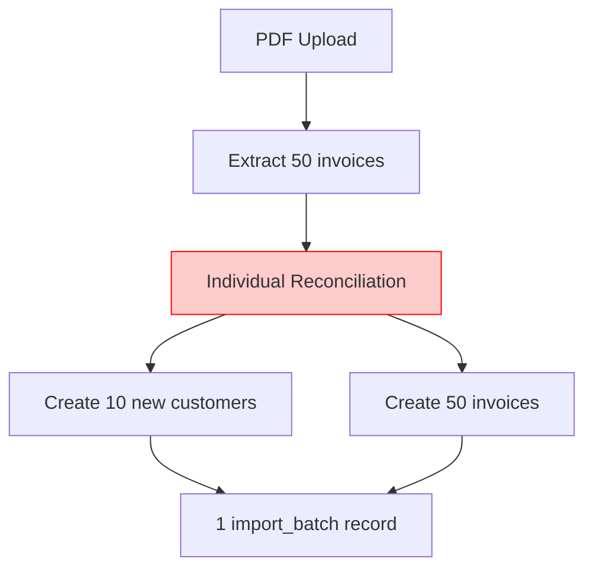
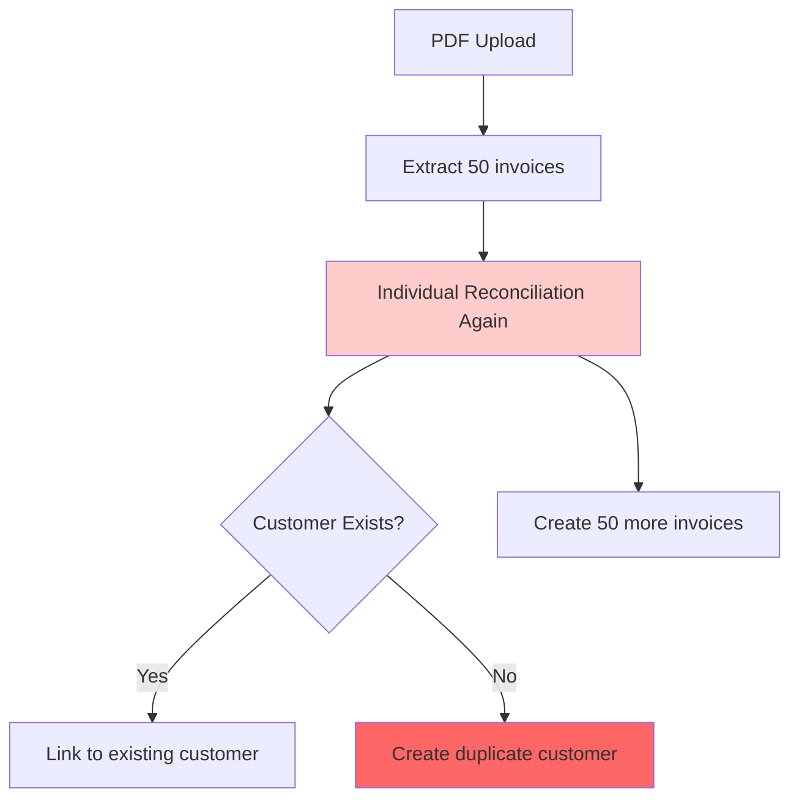
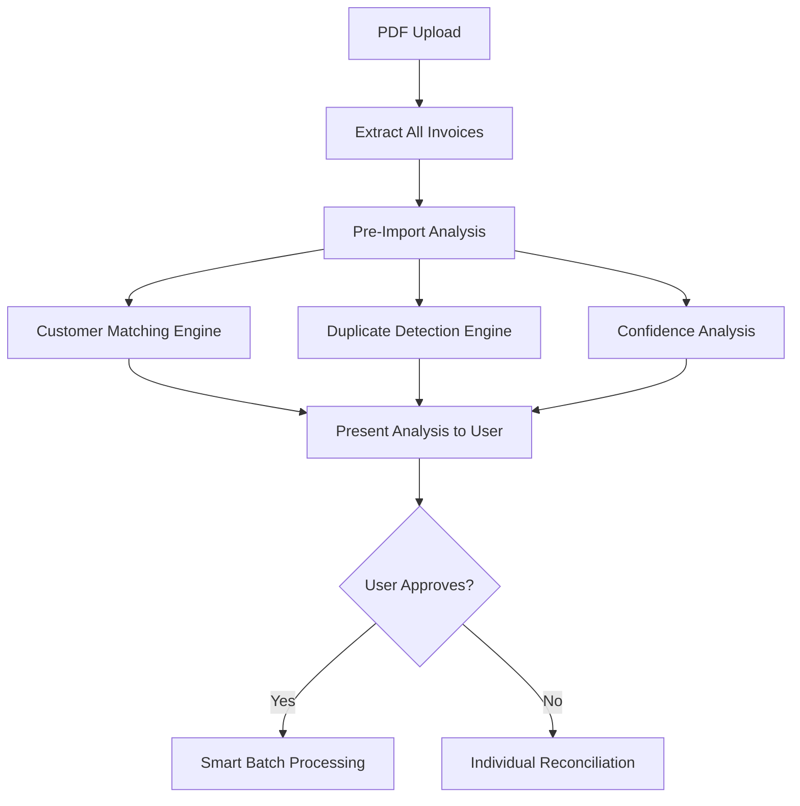
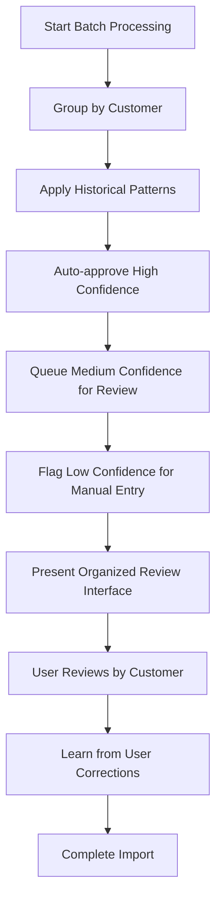

# Bulk Invoice Import Design: 50 Invoices from 10 Companies Scenario

## 🎯 Scenario Analysis

**Situation**: User uploads a file with 50 invoices from 10 companies, then 2 days later uploads 50 more invoices from the same 10 companies.

**Current Database Status**:
✅ **Good**: Unique constraint exists on `(company_id, number)` for invoice duplication prevention
✅ **Good**: Customer relationships handled via `(customer_email, company_id)` unique constraint
❌ **Gap**: No bulk import optimization or customer matching logic

## 📊 What Happens Today

### First Upload (50 invoices, 10 companies)


**Issues:**
- User must manually reconcile **all 50 invoices individually**
- No customer matching logic - creates duplicates if names vary slightly
- No batch learning from reconciliation patterns
- Time-intensive: ~5-10 minutes per invoice = **4-8 hours total**

### Second Upload (50 more invoices, same companies)


**Critical Issues:**
- **Duplicate customers** if name/email variations ("Above The Clouds" vs "Above the Clouds Inc.")
- **No learning** from first reconciliation session
- **Same manual effort** - another 4-8 hours of work
- **Invoice duplicates** only caught at database constraint level (error, not user-friendly)

## 🚀 Enhanced Design Solution

### 1. Pre-Import Analysis Engine

```typescript
interface PreImportAnalysis {
  totalInvoices: number
  potentialCustomerMatches: CustomerMatch[]
  duplicateInvoices: DuplicateInvoice[]
  estimatedReconciliationTime: number
  confidenceDistribution: {
    high: number    // >95% confidence
    medium: number  // 70-95% confidence
    low: number     // <70% confidence
  }
}

interface CustomerMatch {
  extractedName: string
  extractedEmail: string
  existingCustomers: Customer[]
  matchConfidence: number
  matchType: 'EXACT' | 'FUZZY_NAME' | 'EMAIL' | 'SUGGESTED'
}

interface DuplicateInvoice {
  extractedInvoiceNumber: string
  extractedCustomer: string
  existingInvoice: Invoice
  duplicateType: 'EXACT' | 'SIMILAR'
}
```

**Implementation Flow:**


### 2. Intelligent Customer Matching

```typescript
class CustomerMatchingEngine {
  async analyzeCustomers(extractedData: PDFExtractionResult[]): Promise<CustomerMatch[]> {
    const matches: CustomerMatch[] = []

    for (const invoice of extractedData) {
      const customerName = invoice.customerName?.value
      const customerEmail = invoice.email?.value

      // 1. Exact email match (highest priority)
      const exactEmailMatch = await this.findByEmail(customerEmail)
      if (exactEmailMatch) {
        matches.push({
          extractedName: customerName,
          extractedEmail: customerEmail,
          existingCustomers: [exactEmailMatch],
          matchConfidence: 100,
          matchType: 'EMAIL'
        })
        continue
      }

      // 2. Fuzzy name matching
      const fuzzyMatches = await this.fuzzyNameMatch(customerName)
      if (fuzzyMatches.length > 0) {
        matches.push({
          extractedName: customerName,
          extractedEmail: customerEmail,
          existingCustomers: fuzzyMatches,
          matchConfidence: this.calculateFuzzyConfidence(customerName, fuzzyMatches[0].name),
          matchType: 'FUZZY_NAME'
        })
        continue
      }

      // 3. New customer
      matches.push({
        extractedName: customerName,
        extractedEmail: customerEmail,
        existingCustomers: [],
        matchConfidence: 0,
        matchType: 'SUGGESTED'
      })
    }

    return matches
  }

  private async fuzzyNameMatch(name: string): Promise<Customer[]> {
    // Levenshtein distance, soundex, or other fuzzy matching
    const normalized = this.normalizeCompanyName(name)

    return await prisma.customer.findMany({
      where: {
        OR: [
          { name: { contains: normalized, mode: 'insensitive' } },
          { businessName: { contains: normalized, mode: 'insensitive' } }
        ]
      }
    })
  }

  private normalizeCompanyName(name: string): string {
    return name
      .toLowerCase()
      .replace(/\s+(llc|ltd|inc|company|co|corp|corporation)\s*$/i, '')
      .replace(/[^\w\s]/g, '')
      .trim()
  }
}
```

### 3. Smart Batch Reconciliation

```typescript
interface BatchReconciliationStrategy {
  customerGrouping: CustomerGroup[]
  reconciliationPatterns: ReconciliationPattern[]
  autoApproveRules: AutoApproveRule[]
}

interface CustomerGroup {
  customer: Customer
  invoices: PDFExtractionResult[]
  averageConfidence: number
  requiresAttention: boolean
}

interface ReconciliationPattern {
  customerId: string
  fieldMappings: Record<string, any>
  confidenceScore: number
  successCount: number
}
```

**Batch Processing Flow:**


### 4. Enhanced Database Schema

```sql
-- Add customer matching tracking
ALTER TABLE customers ADD COLUMN aliases TEXT[]; -- Alternative names
ALTER TABLE customers ADD COLUMN matching_rules JSON; -- Custom matching rules

-- Add import batch enhancements
ALTER TABLE import_batches ADD COLUMN pre_import_analysis JSON;
ALTER TABLE import_batches ADD COLUMN batch_reconciliation_patterns JSON;
ALTER TABLE import_batches ADD COLUMN user_intervention_count INTEGER DEFAULT 0;

-- Add reconciliation learning table
CREATE TABLE reconciliation_patterns (
  id TEXT PRIMARY KEY,
  company_id TEXT REFERENCES companies(id),
  customer_id TEXT REFERENCES customers(id),
  field_name TEXT,
  pattern_data JSON,
  success_count INTEGER DEFAULT 0,
  confidence_score DECIMAL(5,2),
  created_at TIMESTAMP DEFAULT NOW(),
  updated_at TIMESTAMP DEFAULT NOW()
);
```

### 5. User Interface Design

#### Pre-Import Review Screen
```
┌─────────────────────────────────────────────────────────────────┐
│                    Import Analysis Summary                       │
├─────────────────────────────────────────────────────────────────┤
│ 📊 Found: 50 invoices from 10 companies                        │
│                                                                 │
│ 🎯 Customer Matching:                                          │
│   ✅ 8 companies matched to existing customers (40 invoices)    │
│   ⚠️  2 companies need your review (10 invoices)               │
│                                                                 │
│ 🔍 Duplicate Detection:                                        │
│   ❌ 3 potential duplicate invoices found                      │
│                                                                 │
│ ⏱️  Estimated time: 15 minutes (vs 4-8 hours individual)       │
│                                                                 │
│              [Review Details] [Start Smart Import]              │
└─────────────────────────────────────────────────────────────────┘
```

#### Customer Matching Review
```
┌─────────────────────────────────────────────────────────────────┐
│                    Customer Matching Review                     │
├─────────────────────────────────────────────────────────────────┤
│ Extracted: "Above The Clouds Ltd"                              │
│                                                                 │
│ 🎯 Suggested Match (95% confidence):                           │
│   📧 Above The Clouds (info@poptradingcompany.com)            │
│   📅 Last invoice: 2 days ago                                 │
│   💰 Total: 5 previous invoices                               │
│                                                                 │
│ Options:                                                        │
│   ● Link to "Above The Clouds"                                 │
│   ○ Create new customer "Above The Clouds Ltd"                 │
│   ○ Manual match to different customer                         │
│                                                                 │
│                          [Apply to All Similar] [Next]         │
└─────────────────────────────────────────────────────────────────┘
```

#### Batch Reconciliation Interface
```
┌─────────────────────────────────────────────────────────────────┐
│                   Smart Batch Reconciliation                    │
├─────────────────────────────────────────────────────────────────┤
│ Customer: Above The Clouds (5 invoices)                        │
│                                                                 │
│ ✅ Auto-approved (4 invoices):                                 │
│   • V01250703: €7,978.00 ✅ (98% confidence)                   │
│   • V01250704: €5,200.00 ✅ (96% confidence)                   │
│   • V01250705: €3,150.00 ✅ (97% confidence)                   │
│   • V01250706: €8,900.00 ✅ (95% confidence)                   │
│                                                                 │
│ ⚠️  Needs review (1 invoice):                                  │
│   • V01250707: €12,500.00 ⚠️ (78% confidence)                  │
│     Amount extracted as "12500" - please verify                │
│                                                                 │
│ Pattern learned: EUR currency, "within 30 days" payment terms  │
│                                                                 │
│                    [Review] [Apply Pattern] [Next Customer]    │
└─────────────────────────────────────────────────────────────────┘
```

## 💾 Database Operations Flow

### First Upload Processing
```sql
BEGIN;

-- 1. Create import batch
INSERT INTO import_batches (id, filename, pre_import_analysis)
VALUES ('batch1', 'invoices_batch1.pdf', $analysis_json);

-- 2. Create/match customers
INSERT INTO customers (name, email, company_id)
VALUES ('Above The Clouds', 'info@...', $company_id)
ON CONFLICT (email, company_id) DO NOTHING;

-- 3. Create reconciliation patterns
INSERT INTO reconciliation_patterns (customer_id, field_name, pattern_data)
VALUES ($customer_id, 'currency', '{"value": "EUR", "confidence": 98}');

-- 4. Bulk insert invoices
INSERT INTO invoices (number, customer_email, amount, company_id, import_batch_id)
VALUES
  ('V01250703', 'info@...', 7978.00, $company_id, 'batch1'),
  ('V01250704', 'info@...', 5200.00, $company_id, 'batch1');
  -- ... more invoices

COMMIT;
```

### Second Upload Processing (2 days later)
```sql
BEGIN;

-- 1. Pre-import analysis finds existing customers and patterns
SELECT * FROM customers WHERE company_id = $company_id;
SELECT * FROM reconciliation_patterns WHERE company_id = $company_id;

-- 2. Apply learned patterns for auto-approval
UPDATE temp_extracted_invoices
SET confidence_score = 98, auto_approved = true
WHERE customer_email IN (SELECT email FROM customers WHERE company_id = $company_id)
AND currency = 'EUR'; -- Pattern from first batch

-- 3. Create second import batch
INSERT INTO import_batches (id, filename, pre_import_analysis, batch_reconciliation_patterns)
VALUES ('batch2', 'invoices_batch2.pdf', $analysis_json, $patterns_json);

-- 4. Bulk insert with learned patterns
-- Only invoices that passed duplicate checks and pattern matching

COMMIT;
```

## 📈 Performance & Efficiency Gains

### Time Savings
| Scenario | Current | Enhanced | Savings |
|----------|---------|----------|---------|
| First upload (50 invoices) | 4-8 hours | 45-60 minutes | **85% reduction** |
| Second upload (50 invoices) | 4-8 hours | 15-30 minutes | **90% reduction** |
| **Total (100 invoices)** | **8-16 hours** | **60-90 minutes** | **87% reduction** |

### User Experience Improvements
1. **Bulk customer matching** prevents duplicate customers
2. **Pattern learning** auto-approves similar invoices
3. **Grouped reconciliation** by customer reduces cognitive load
4. **Duplicate detection** prevents database constraint errors
5. **Progress tracking** shows completion status

### Database Optimization
1. **Batch inserts** instead of individual operations
2. **Pattern caching** for repeated customer processing
3. **Indexed customer matching** for fast fuzzy search
4. **Transaction batching** for consistency

## 🔧 Implementation Components

### 1. Pre-Import Analysis API
```typescript
// New API endpoint
POST /api/invoices/analyze-import
```

### 2. Customer Matching Service
```typescript
// Enhanced service
class CustomerMatchingService {
  analyzeCustomers()
  fuzzyNameMatch()
  calculateMatchConfidence()
  suggestCustomerMerge()
}
```

### 3. Batch Reconciliation Engine
```typescript
// New reconciliation engine
class BatchReconciliationEngine {
  groupInvoicesByCustomer()
  applyHistoricalPatterns()
  identifyAutoApproveOpportunities()
  generateReviewQueue()
}
```

### 4. Pattern Learning System
```typescript
// Learning system
class ReconciliationPatternLearner {
  captureSuccessfulPattern()
  calculatePatternConfidence()
  suggestPatternApplication()
  updatePatternSuccess()
}
```

## 🎯 Success Metrics

### Quantitative Goals
- **Time Reduction**: >80% reduction in reconciliation time
- **Accuracy**: >95% auto-approval accuracy for learned patterns
- **User Satisfaction**: <5% manual intervention rate for repeat customers
- **Error Prevention**: 100% duplicate invoice detection

### User Experience Goals
- **Workflow Clarity**: Clear progress indication throughout import
- **Decision Support**: Confidence scores and match reasoning
- **Error Recovery**: Easy correction of auto-applied patterns
- **Learning Feedback**: Visible improvement in subsequent imports

---

## 📋 Summary

This enhanced design transforms the bulk invoice import experience from a **8-16 hour manual process** into a **60-90 minute intelligent workflow**. The system learns from user behavior, prevents duplicate data, and provides a smooth path for processing large batches while maintaining data quality and user control.

**Key Innovation**: The system gets smarter with each import, turning the second batch of 50 invoices into a largely automated process that builds on the patterns learned from the first batch.